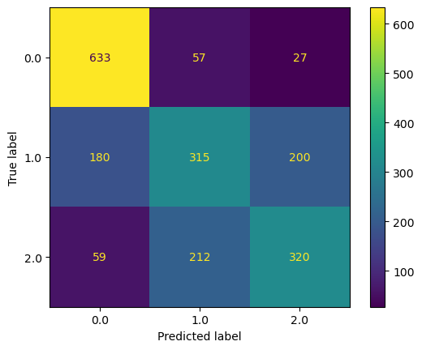

# NFL Combine and Draft Classification

# **Author**: Josh Palgon

## Overview

The NFL Draft is the most important way to acquire talented players. I am going to give any prespective team insight into which players get selected on the first 2 days of the draft (rounds 1-3) where the majority of NFL starters are found, which players get selected on day 3 (rounds 4-7) and which players will be undrafted.

My data was web scraped from sports-reference.com and merged with the NFL_data Python package.

Combine athletic testing data played a key role in helping separate where in the draft players are selected, especially weight adjusted statistics that I feature engineered.

Offensive stats carry a strong weight than defensive stats in separating the draft rounds of players. The final season of a players' career was more important than their career stats with QB being an exception.

It was easier to separate drafted players from undrafted players, than day 1 or 2 players from day 3 players.

## Business Problem

Any NFL team is always looking for any minor edge to build a better football team. With the NFL Draft being the best way to improve a team, being able to know which day a player will be drafted or if they will be drafted at all would be extremely valuable. I am offering my skills, services, and research on the draft to any team who is interested.

While there are several applications to classifying which day a player will get drafted. The primary application would be using a players' expected draft round as a tie-breaker. By selecting the player who is likely to get drafted earlier, there is a chance that they can select the other player later in the draft.

## Data

The majority of my data was web scraped from sports-reference.com. Having scrapped very similar data from sports-reference before, I did not run into nearly as many issues as the first time. However one major obstacle I have yet to overcome is how to get the secondary statistics for a player. For example for QBs I only have their passing data but not their rushing information. While this is obviously not ideal, the addition of the combine testing data should help offset the loss of rushing information.

I used a sleep-timer of 3.15 to adhere to sports-references web scraping restrictions. They do update their page so I proved the link here https://www.sports-reference.com/bot-traffic.html in case anyone trying to replicate this process runs into any 429 HTTP Error requests.

Additionally, I supplemented the sportsreference data with the NFL_data Python package for a few extra features.

## Modeling

For my modeling I separated my numeric columns from my categorical columns. On my categorical columns, I OneHotEncoded them. On my numerical columns, I used a simple imputer to handle the NaNs and impute 0 as any NaN should be 0 anyway based on how I scraped my data. Additionally, I used a StandardScaler on the numerical data. I had a very balanced class dataset so StandardScaler was appropriate.

Late in the game I tried combinations of SMOTE, RandomOverSampler and RandomUnderSampler with different strategy weights. The use of RandomUnderSampler created an increase in recall but at the cost of accuracy. I will continue to tune these parameters for all models in attempt to get some better results. For my final model oversampling with a strategy ratio of 1 was my best to balance the data.

In total I ran 6 different models:
- GaussianMixture
- Decision Tree
- Random Forest
- KNN
- XGBoost
- 

### Logistic Regression Matrix

Predicting enough correct first round picks is very tricky with the class imbalance. Logistic Regression wasn't my best model for recall but the models that maximized recall had too poor of accuracy scores to be helpful. While I was hoping for some better predictions, this model is on the right track as it's accuracy was solid especially given was projecting players in the first round at a much higher rate than the classes indicate.

## Evaluation

### Age by Position for each Round

For each position the age of the round 1 players is significantly lower than the non round 1 players.

### College Conferences

The power 5 conferences have all of the highest ratios of players drafted in round 1. 12.5% is the expected first round ratio.

### Position Ratio

Premium positions have the highest ratios of players drafted in round 1. 12.5% is the expected first round ratio.

## Conclusions

Premium positions, top conferences, and age are the biggest driving factors which isn't surprising.

While age is significant in predicting round 1 players, it complicates some takeaways from numerical data.

Rate stats better than cumulative stats mainly due to the fact that many of the best players declare their junior year and don't play in their would be senior season.

## Next steps:

Get more data
- Final season
- Advanced stats
- Non Primary Stats
- More bio information

Add scouting report information and other non numeric data

## What I learned

If you are going to web scrape data, make sure to give yourself extra time to either get the scraper to work or to have a backup plan. If I had not found the guide on the web scraping requirements of sportsreference I am not sure I would have gotten the numerical data I had.

Due to the web scraping not being finished until a few days before the project was due, I was not able to finish nearly as much as I would have liked. After seeing my models' results I realized that I needed more data. For starters I would have added at least 5 more years to the data. Additionally, I would have gotten each individual college season for each player instead of just their career totals. There is the possibility that additional information would not have made much of a difference as projecting the NFL draft is a very difficult task, however it would have been good to do this step after my models' yielded somewhat underwhelming results.

## For More Information

Please look at my full analysis in [my Jupyter Notebooks](https://github.com/jpalgon/Draft_Combine) or my [presentation](./Draft_Combine.pdf).

For any additional questions, please contact:

<ul>
    <li>Josh Palgon (jopalgon@gmail.com)</li>
</ul>
